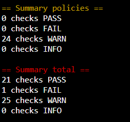

# Diving Deep: An In-Depth Look at Securing Your Azure Kubernetes Service

In this series of articles, we will delve into specific aspects of AKS security and demonstrate how to meet its security requirements. The topics that will be covered include:

- Adhering to the CIS Benchmark
- Utilizing AppArmor and seccomp
- Keeping track of Audit Logs
- Implementing Network policies
- Securing both Egress and Ingress traffic.

The Center for Internet Security (CIS) Benchmark is a collection of configuration guidelines developed and maintained by cybersecurity experts to protect against current cyber threats. It is a volunteer-driven effort led by subject matter experts from various technology products. There are over 100 CIS Benchmarks for more than 25 vendor product families. To learn more about CIS Benchmarks, refer to the CIS Benchmark FAQ. CIS Benchmarks are widely considered to be an industry standard for cybersecurity.

By reviewing the CIS Benchmark document for Kubernetes, you will discover that there are instructions for both master nodes and worker nodes. However, in the case of AKS, it is not possible to access the master nodes. To assist in this situation, there is also a dedicated CIS Benchmark document specifically for AKS.

It is advisable to download and review the benchmark document for AKS. You will notice that there is only one instruction for master nodes, which concerns enabling Audit Logs. We will be discussing Audit Logs in this series. Before we proceed, I suggest that you familiarize yourself with the Security Hardening for AKS node Host OS guide. It also mentions some CIS benchmarks that have already been set up by Microsoft.
# 
## Setting up the Environment
As indicated in the CIS Benchmark document for AKS, one of the fundamental requirements for meeting the benchmarks is to gain access to the worker nodes through SSH. Let's begin by doing that.
#
### Step 1

To start, open the Azure portal and navigate to your AKS Cluster. Click on the "connect" button. Take note of the first two commands listed on the right-hand side.
#

### Step 2

Access the Azure Cloud Shell. Execute those 2 commands in order to connect to your AKS cluster. Then run the command "kubectl get nodes -o wide" to obtain the internal IPs of the worker nodes. Make a note of these IPs, as they will be needed later.

### Step 3

Retrieve the Node Resource Group (resource group that starts with MC\_) and the VM Scale Set that corresponds to it. In this example, the name of the resource group is “aksgithubcicdrg” and the AKS cluster name is “aksgithubcicd”.

NODE\_RESOURCE\_GROUP=$(az aks show --resource-group aksgithubcicdrg --name aksgithubcicd --query nodeResourceGroup -o tsv)

SCALE\_SET\_NAME=$(az vmss list --resource-group $NODE\_RESOURCE\_GROUP --query [0].name -o tsv)

### Step 4

Configure SSH to the worker nodes:

az vmss extension set --resource-group $NODE\_RESOURCE\_GROUP --vmss-name $SCALE\_SET\_NAME --name VMAccessForLinux --publisher Microsoft.OSTCExtensions --version 1.4 --protected-settings "{\"username\":\"azureuser\", \"ssh\_key\":\"$(cat ~/.ssh/id\_rsa.pub)\"}"

az vmss update-instances --instance-ids '\*' --resource-group $NODE\_RESOURCE\_GROUP --name $SCALE\_SET\_NAME

### Step 5

Although we have set up SSH for the worker nodes, we are unable to connect to them as they only have internal IPs. To overcome this issue, we will create a pod to establish a connection to the worker nodes.

kubectl run aks-ssh --image=nginx --restart=Never

Next, we will access the pod and install the OpenSSH client. Then we will exit the pod.

kubectl exec -it aks-ssh -- bash

`  `apt-get update && apt-get install openssh-client -y

`  `exit

### Step 6

Afterwards, we will copy the RSA key to the pod and use it to SSH to one of the nodes from within the pod using the internal IP.

kubectl cp ~/.ssh/id\_rsa $(kubectl get pod -l run=aks-ssh -o jsonpath='{.items[0].metadata.name}'):/id\_rsa

kubectl exec -it aks-ssh -- bash

chmod 0600 id\_rsa

ssh -i id\_rsa azureuser@10.0.0.4

Now that you have access to all individual nodes, it's time to implement CIS Benchmark on the worker nodes as outlined in the CIS Benchmark document for AKS. We will review each suggestion in the document and take actions to address them. Before we begin, it's useful to check what's already been set up. To do this, we will use a tool called Kube-Bench. It automates the process of checking if all the standards recommended in CIS Benchmark are configured or not.

### Step 7

SSH to one of your worker nodes and install Docker:

sudo snap install docker

Check this GitHub article: 

<https://github.com/aquasecurity/kube-bench/blob/main/docs/running.md>. And run the first command given under heading “Running Inside a Container”.

sudo docker run --pid=host -v /etc:/etc:ro -v /var:/var:ro -t aquasec/kube-bench:latest --version 1.18

Here is the summary of the checks for one of my nodes:

### Step 8

As we can see, one check has failed, let's determine which one it is.

Now, refer back to the CIS Benchmark document for AKS and check section 4.1.5 for the remediation action. In this manner, you can also evaluate other configurations as outlined in the document and take appropriate remediation actions. That is the overall process. Remember to uninstall Docker once you have finished (sudo snap remove docker). We will cover AppArmor and Seccomp in the next part of this series.