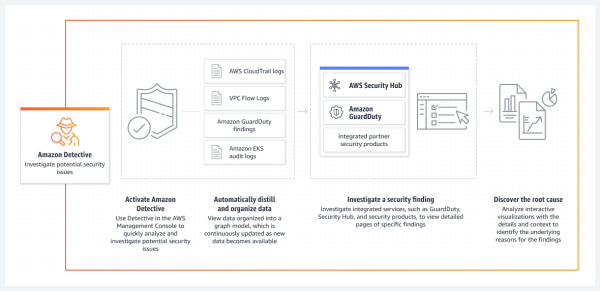
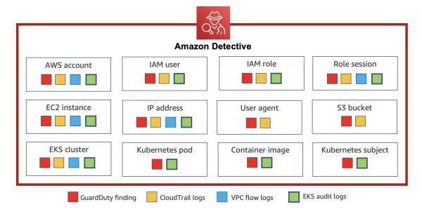
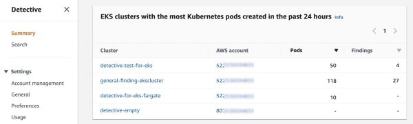
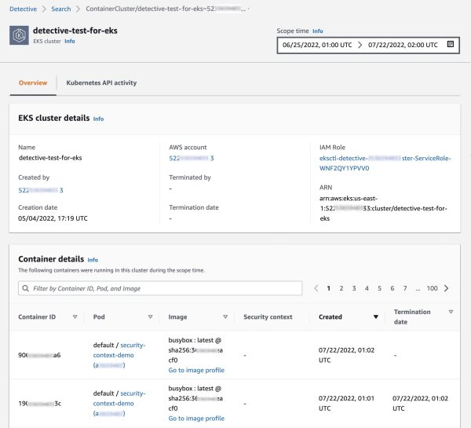
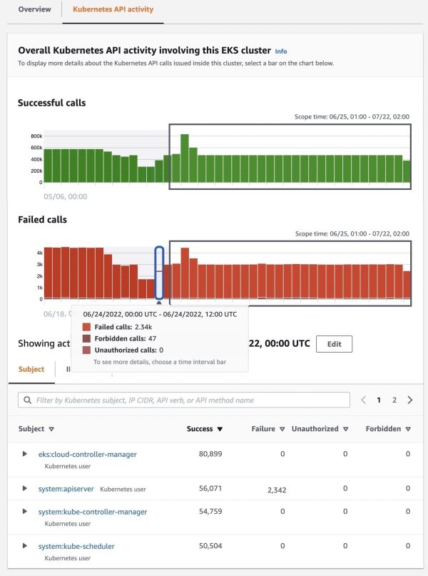

# EKS Sleuth: Investigating and Taking Action on Security Issues in Amazon EKS Clusters with Amazon Detective

#
Amazon Detective is a tool that helps identify the source of security concerns or unusual activity. It specifically works well for investigating security issues related to Kubernetes Workloads on Amazon EKS, making it simple to address these problems. Kubernetes is an open-source system for managing and organizing containers, which are deployed using Amazon Elastic Kubernetes Service (Amazon EKS). Amazon Detective can be used to effectively improve the security of these deployments on Amazon EKS.

### **Amazon Detective**
Amazon Detective is a tool that helps investigate security issues by collecting log data from AWS resources and using advanced techniques such as machine learning, statistical analysis, and graph theory. It makes the investigation process easier by pre-building data aggregations, summaries, and context. Additionally, it provides a visualization layer to view the data variation in volume and type of activity over a selected time window and links the changes to GuardDuty findings.

Furthermore, it automatically extracts temporal events like login attempts, API calls, and network traffic from Amazon GuardDuty and Amazon VPC flow logs and converts them into graph models. These graphs provide a summary of resource behavior and interactions observed across the AWS environment and give you more detailed information about failed login attempts or suspicious API calls.

### **Investigating the security of workloads running on Kubernetes using Amazon Detective**
By enabling Amazon Detective, it will ingest EKS audit logs to examine API activities from users, applications, and the control plane in Amazon EKS for Kubernetes subjects. Below is how it works:

- GuardDuty: used to detect malicious activities and unauthorized access
- CloudTrial: used to correlate user activities
- VPC flow logs: used to correlate network activities
- EKS audit logs: used to gather information about resources created on EKS for behavior analysis

In the event of security threats on Amazon EKS clusters, Amazon Detective can be used to identify and layer them on top of the entity profile with the help of Amazon GuardDuty Kubernetes Protection. Amazon Detective for Kubernetes workloads provides information about the Kubernetes API used by a compromised user account, as well as findings on pods hosted on Amazon EC2 or containers created from malicious container images.

Steps to start security investigation on EKS audit logs:

1. Enable Amazon Detective on the AWS Management Console
1. Go to settings, under the General option,
1. Under the Optional Source Package, enable EKS Audit Logs.

After enabling, Detective begins monitoring the Kubernetes audit logs generated by Amazon EKS for security purposes. The recent monitoring results of EKS clusters can be viewed under the summary page.

When you select one of the EKS clusters, you will have access to information about the containers running on that cluster, the Kubernetes API used, and network activities associated with it.

By accessing the Kubernetes API Activity tab, you can view API activities that occurred in the EKS cluster. You can also choose a specific time frame and see successful, failed, forbidden, and unauthorized API calls that were made during that time.

### **Conclusion**
Using Amazon Detective for security investigation of Kubernetes Workloads on Amazon EKS can help provide overall security. Amazon Detective for EKS is available in all regions where Amazon Detective is available, and offers a 30-day free trial during which you can get an idea of the monthly cost of the service, and how it can be used to meet your security needs.

